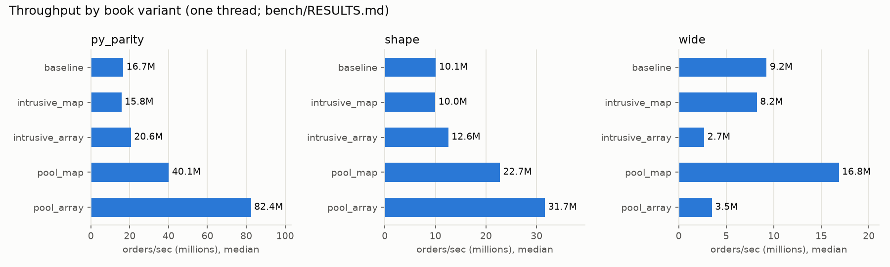
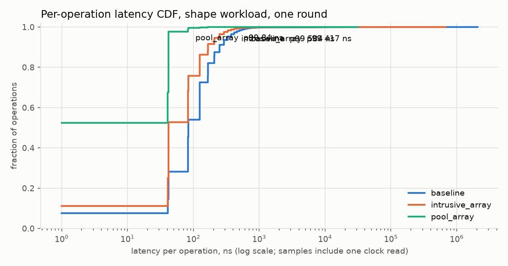

# orderbook-cpp

A single-instrument limit order book and matching engine in C++20: price-time
priority, integer ticks and lots (no floating point in the engine), Limit (GTC),
Market, IOC, FOK, cancel and modify. It is the C++ successor to my Python engine
([stevenmaswim/order-book](https://github.com/stevenmaswim/order-book)) and is
benchmarked against it on the identical op stream.

The design, every trade-off and the reasons behind it are in [DESIGN.md](DESIGN.md).

## What is in here

| Piece | Where | What it is |
|---|---|---|
| Baseline book | [`include/ob/baseline_book.hpp`](include/ob/baseline_book.hpp) | `std::map` ladder, `std::list` FIFO per level, id to iterator index. Kept as the comparison point. |
| Upgraded book | [`include/ob/order_book.hpp`](include/ob/order_book.hpp) | `OrderBook<Ladder, Storage>`: intrusive FIFO levels, with the price ladder and order storage as template policies so each upgrade is measured on its own |
| Price ladders | [`map_ladder.hpp`](include/ob/map_ladder.hpp), [`array_ladder.hpp`](include/ob/array_ladder.hpp) | red-black tree vs flat tick-indexed array with a cached best level |
| Order storage | [`heap_storage.hpp`](include/ob/heap_storage.hpp), [`pool_storage.hpp`](include/ob/pool_storage.hpp), [`flat_id_map.hpp`](include/ob/flat_id_map.hpp) | `new` + `std::unordered_map` vs a preallocated node pool + open-addressing id table |
| SPSC ring | [`include/ob/spsc_ring.hpp`](include/ob/spsc_ring.hpp) | bounded single-producer single-consumer ring (acquire/release, cache-line separated indices) between a gateway thread and the matcher thread |
| ITCH replay | [`include/ob/itch.hpp`](include/ob/itch.hpp) | NASDAQ TotalView-ITCH 5.0 parser feeding one book per stock |
| Benchmarks | [`bench/`](bench/) | throughput, per-op latency percentiles, the Python comparison, the pipeline and ITCH replay; [`bench/RESULTS.md`](bench/RESULTS.md) is generated |

Book variants, as named in the tests and benchmarks:

| Name | Ladder | Storage | Menu item |
|---|---|---|---|
| `baseline` | `std::map` | `std::list` nodes + `std::unordered_map` | baseline |
| `intrusive_map` | `std::map` | intrusive levels, `new` per order | A |
| `intrusive_array` | flat array | intrusive levels, `new` per order | C |
| `pool_map` | `std::map` | node pool + flat id table | B |
| `pool_array` | flat array | node pool + flat id table | B + C |

## How correctness is checked

- **Unit tests per order type**, written as gtest typed tests: every case runs
  against all five books and the reference model.
- **Differential fuzz** ([`tests/fuzz_differential.cpp`](tests/fuzz_differential.cpp)):
  seeded random op streams, skewed toward edge cases, run against each book and
  a deliberately naive O(n) reference book
  ([`tests/reference_book.hpp`](tests/reference_book.hpp)). After every op, the
  event streams and full book snapshots must be identical. The default ctest
  run is 500 seeds x 1,000 ops; `OB_FUZZ_SEEDS=20000` runs a longer sweep. Five
  deliberately injected bugs were each caught.
- **Invariant checker** ([`tests/invariants.hpp`](tests/invariants.hpp)), ported
  from the Python engine and run after every fuzz step. It rebuilds its own
  ledger from the events alone and checks it against the book: quantity
  conservation, trades at the maker's price, never crossed, level totals equal
  a recount, FIFO order, and more.
- **Zero allocation on the hot path** for `pool_array`
  ([`tests/alloc_test.cpp`](tests/alloc_test.cpp)): every global `operator new`
  is replaced with a counting version, and replaying 200k ops must allocate
  nothing. Two positive controls show the counter works.
- **Sanitizers**: the whole suite runs under ASan + UBSan and under TSan (the
  ring's two-thread tests). Weakening one release store to relaxed makes TSan
  fail the test.
- **Cross-language check**: replaying the Python engine's own benchmark op
  stream, every C++ book ends in exactly the Python engine's final state
  (trades, volume, every price level). `bench/run_all.py` refuses to write
  results otherwise.
- **CI** ([`.github/workflows/ci.yml`](.github/workflows/ci.yml)): Linux x86-64,
  {gcc-14, clang-18} x {Release, ASan+UBSan, TSan}.

## Performance

All numbers live in [`bench/RESULTS.md`](bench/RESULTS.md), generated by
`bench/run_all.py` together with the machine, compiler, exact flags, git commit,
workload, seed, trace hash and the load average at the start of the run. Each
figure is a median over interleaved rounds and is shown with its min..max
spread. Nothing here is hand-edited.




What the measurements showed, in words (the numbers are in RESULTS.md):

- The pool (B) is the biggest single win. With the flat ladder, the tested op
  streams make no call to `operator new` at all after construction.
- The flat array ladder (C) wins on dense books and loses badly on a sparse
  one (the `wide` workload), where emptying the best level scans the tick gap.
  The map ladder is the safer default when the price range is unknown.
- Intrusive lists alone (A) were roughly neutral: they replace one allocation
  with another. Their value is that they make the pool possible.
- The SPSC ring (E) does not make matching faster. It moves work to a second
  thread, and the extra cross-core handoff costs throughput. Padding the
  indices onto separate cache lines beat packing them together in every
  recorded run (see the pipeline table).
- Shrinking `Level` from 40 to 32 bytes (F) helped the array ladder. Two other
  layout ideas were measured and rejected
  ([`bench/experiments/layout/`](bench/experiments/layout/)).

## Demo

A guided tour: every order type in turn, printing the events and the book
after each step, then a short load run.

```bash
cmake --preset release && cmake --build --preset release -j
./build/release/examples/ob_demo
```

## Build and test

Needs CMake 3.24+ and a C++20 compiler. GoogleTest is fetched on first configure.

```bash
cmake --preset debug && cmake --build --preset debug -j && ctest --preset debug
# also: asan-ubsan, tsan, release
```

## Reproduce the benchmarks

```bash
cmake --preset release && cmake --build --preset release -j
python3 bench/run_all.py                     # writes bench/RESULTS.md
# Python comparison needs the Python engine repo next to this one:
#   ../Order_book_project with its .venv (see bench/py_parity/)
# Optional ITCH section: fetch a prefix of a public NASDAQ sample first
tools/fetch_itch_sample.sh 64
# Charts:
../Order_book_project/.venv/bin/python3.11 tools/plot_bench.py
```

Benchmark on a quiet machine. On a laptop with other apps open, macOS can
place a benchmark process on an efficiency core (there is no hard core pinning
on macOS), and the spread columns in RESULTS.md will show it.

## License

MIT
